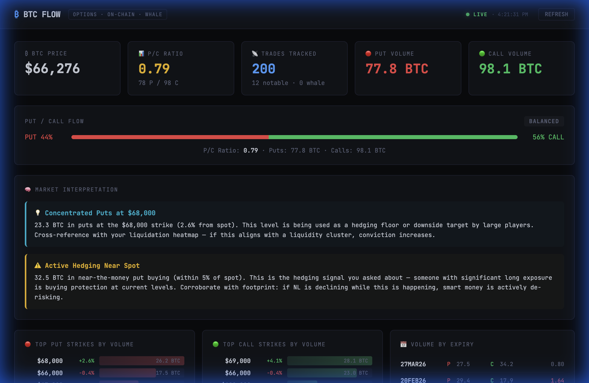

# ₿ BTC Options Flow — Real-Time Whale Tracking Terminal

A real-time BTC options flow dashboard that pulls directly from Deribit's public API. No paid data feeds. No API keys. Just raw institutional flow — parsed, interpreted, and tracked live.



## Features

### 📊 Live Market Overview
- **Real-time BTC price** from Deribit
- **Put/Call ratio** with volume breakdown
- **Sentiment bar** — visual put/call flow balance
- **Auto-refresh** every 15 seconds

### 🧠 Market Interpretation Engine
Auto-generates actionable insights from the options flow:
- Concentrated strike detection (hedging floors / downside targets)
- Active hedging signals (near-the-money put buying)
- Cross-reference prompts with liquidation heatmaps

### 🔥 Strike Heatmaps & Expiry Breakdown
- **Top put/call strikes by volume** — see where the money is clustering
- **Volume by expiry** — understand the term structure of positioning

### 🐋 Persistent Whale Trade Tracker
Automatically saves and categorizes significant trades with tiered tagging:

| Tier | Threshold | Tag | Color |
|------|-----------|-----|-------|
| 🔱 MASSIVE | $10M+ notional | `🔱 MASSIVE` | Gold |
| ⚡ MAJOR | $1M+ notional | `⚡ MAJOR` | Orange |
| 🐋 WHALE | ≥50 BTC | `WHALE` | Purple |
| 📊 Notable | $100K+ notional | `>100K` | Blue |

- **Pinned sorting** — MASSIVE and MAJOR trades always at the top
- **Persistent storage** — trades survive page refreshes (localStorage)
- **Deduplication** — no duplicate entries, capped at 500 trades
- **Auto-interpretation** — every saved trade gets a plain-English read


### 📡 Live Trade Feed
- All recent options trades in real-time
- Filter by: All, Puts, Calls, Large
- Tagged by size (Notable, Large, Whale)

## Tech Stack

- **React** + **Vite** — fast, modern frontend
- **Deribit Public API** — no authentication required
- **localStorage** — client-side persistence for whale trades
- **Inline styles** — zero CSS dependencies, dark terminal aesthetic

## Quick Start

```bash
# Clone the repo
git clone https://github.com/laloquidity/btc-options-flow.git
cd btc-options-flow/app

# Install dependencies
npm install

# Start the dev server
npm run dev
```

Open [http://localhost:5173](http://localhost:5173) and the dashboard will start pulling live data immediately.

## Project Structure

```
btc-options-flow/
├── app/                          # React application
│   ├── src/
│   │   ├── Dashboard.jsx         # Main dashboard component (all logic + UI)
│   │   ├── App.jsx               # App wrapper
│   │   ├── main.jsx              # Entry point
│   │   └── index.css             # Minimal reset
│   ├── package.json
│   └── vite.config.js
├── bot.py                        # Telegram alerting bot (optional)
├── dashboard.jsx                 # Original standalone component
├── requirements.txt              # Python deps for bot
├── BTC_Flow_System_Setup_Guide.md
└── README.md
```

## Telegram Bot (Optional)

The repo includes a Python Telegram bot (`bot.py`) that sends real-time alerts for:
- Large options trades on Deribit
- On-chain whale BTC movements (via mempool.space)
- P/C ratio shifts

To set it up:
1. Get a bot token from [@BotFather](https://t.me/BotFather)
2. Get your chat ID from [@userinfobot](https://t.me/userinfobot)
3. Edit the `CONFIG` dict in `bot.py`
4. Run: `python bot.py`

See [BTC_Flow_System_Setup_Guide.md](BTC_Flow_System_Setup_Guide.md) for detailed instructions.

## Data Sources

All data comes from **free, public APIs** — no API keys or paid subscriptions needed:

| Source | Data | Rate |
|--------|------|------|
| [Deribit Public API](https://docs.deribit.com/) | Options trades, book summaries, BTC index | 15s refresh |
| [mempool.space](https://mempool.space/) | On-chain transactions (bot only) | Configurable |

## License

MIT
